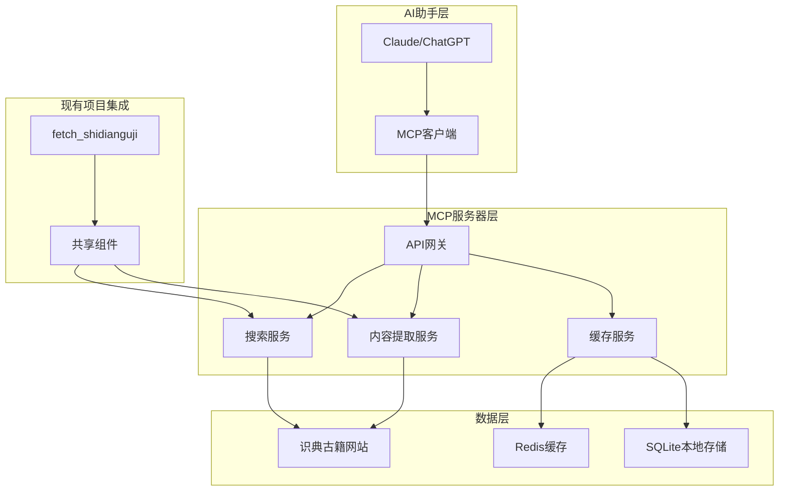

# 古籍MCP服务器项目总结

## 项目可行性分析

### ✅ 技术可行性确认

基于对识典古籍网站搜索功能的深入分析，**完全具备实现MCP服务器的技术条件**：

1. **搜索接口可访问** - 网站提供公开的搜索功能，支持多种搜索模式
2. **数据结构化程度高** - 搜索结果包含完整的书籍信息、内容片段、来源等
3. **内容可提取性强** - 可以获取到包含关键词的具体文本段落和上下文
4. **API化友好** - 搜索结果格式规整，便于解析和格式化

### 🎯 核心价值定位

1. **知识检索增强** - 为AI对话提供权威的古籍知识背景
2. **上下文智能补充** - 实时补充相关古籍内容到对话中
3. **学术研究支持** - 提供准确的古籍文献引用和来源
4. **智能问答能力** - 基于古籍内容的深度对话和问答

## 项目架构设计

### 整体架构图



### 核心功能模块

| 模块 | 功能 | 技术实现 |
|------|------|----------|
| **搜索服务** | 关键词搜索、分类筛选、高级搜索 | requests + BeautifulSoup4 |
| **内容提取** | 书籍信息、内容片段、章节内容 | 复用现有抓取逻辑 |
| **缓存管理** | Redis + SQLite双重缓存 | 智能缓存策略 |
| **MCP协议** | AI助手接口 | Python MCP SDK |
| **内容格式化** | 古籍特殊格式处理 | 自定义格式化器 |

## 技术实现方案

### 1. 与现有项目集成

**代码复用策略**:
- 复用 `ShidiangujiFetcher` 类的核心抓取逻辑
- 共享内容清理和格式化功能
- 统一配置管理和错误处理机制

**独立开发组件**:
- MCP协议实现和工具定义
- 搜索服务逻辑和结果处理
- 缓存管理和性能优化
- AI助手专用接口

### 2. 搜索功能实现

**基础搜索**:
```python
# 支持多种搜索模式
search_ancient_texts(
    keyword="道",
    search_type="full_text",  # full_text|title|author
    category="经部",          # 四部分类筛选
    dynasty="先秦",           # 朝代筛选
    fuzzy=True,              # 模糊搜索
    limit=10                 # 结果数量
)
```

**高级搜索**:
```python
# 支持复杂查询条件
advanced_search({
    "keywords": ["道", "德", "仁"],
    "phrases": ["天人合一"],
    "exclude": ["现代"],
    "filters": {
        "categories": ["经部", "子部"],
        "dynasties": ["先秦", "汉"]
    }
})
```

### 3. 内容提取功能

**书籍信息提取**:
```python
book_info = extract_book_info("HY1523")
# 返回: 书名、作者、朝代、版本、章节列表等
```

**内容片段提取**:
```python
snippets = extract_content_snippets(
    book_id="HY1523",
    keyword="皇极经世",
    context_length=300,
    highlight_keyword=True
)
```

**章节内容提取**:
```python
chapter_content = get_chapter_content(
    book_id="HY1523",
    chapter_id="chapter_1",
    format="markdown"
)
```

## 开发路线图

### 阶段1: 基础架构 (第1-2周)
- [x] 项目结构设计
- [x] MCP协议框架
- [x] 配置管理系统
- [x] 基础工具函数

### 阶段2: 搜索功能 (第3-4周)
- [ ] 搜索接口分析
- [ ] 基础搜索实现
- [ ] 高级搜索功能
- [ ] 搜索优化

### 阶段3: 内容提取 (第5-6周)
- [ ] 书籍信息提取
- [ ] 内容片段提取
- [ ] 章节内容提取
- [ ] 内容格式化

### 阶段4: 性能优化 (第7-8周)
- [ ] 缓存系统实现
- [ ] 并发处理优化
- [ ] 性能监控
- [ ] 负载测试

### 阶段5: 测试文档 (第9-10周)
- [ ] 测试完善
- [ ] 文档编写
- [ ] 示例代码
- [ ] 部署准备

## 预期效果

### 功能效果
1. **智能搜索** - 支持关键词、分类、朝代等多维度搜索
2. **内容提取** - 精确提取古籍内容片段和上下文
3. **AI集成** - 为AI助手提供古籍知识支持
4. **知识增强** - 实时补充对话的古籍背景知识

### 性能指标
- **搜索响应时间**: < 2秒
- **并发处理能力**: > 100 req/s
- **缓存命中率**: > 80%
- **系统可用性**: > 99%
- **内容提取准确率**: > 95%

### 用户体验
- **无缝集成** - AI助手可以直接调用古籍知识
- **智能引用** - 自动生成规范的文献引用
- **上下文增强** - 为对话提供丰富的古籍背景
- **知识图谱** - 构建古籍知识关联网络

## 技术优势

### 1. 复用现有项目
- 充分利用已有的网页抓取和内容处理经验
- 减少重复开发，提高开发效率
- 保持技术栈一致性

### 2. 标准化接口
- 基于MCP协议，与AI助手无缝集成
- 提供RESTful API，支持多种调用方式
- 标准化数据格式，便于扩展

### 3. 高性能设计
- 多级缓存策略，提高响应速度
- 异步处理，支持高并发
- 智能缓存失效，保证数据新鲜度

### 4. 可扩展架构
- 模块化设计，便于功能扩展
- 插件系统，支持自定义功能
- 多数据源支持，可扩展到其他古籍网站

## 风险评估

### 技术风险
| 风险 | 影响 | 概率 | 应对策略 |
|------|------|------|----------|
| 网站接口变更 | 高 | 中 | 实现接口适配层 |
| 搜索性能不达标 | 中 | 中 | 多级缓存优化 |
| 内容提取准确率低 | 中 | 低 | 增强解析算法 |

### 项目风险
| 风险 | 影响 | 概率 | 应对策略 |
|------|------|------|----------|
| 开发进度延期 | 中 | 中 | 调整优先级 |
| 需求变更频繁 | 中 | 中 | 敏捷开发 |
| 测试覆盖不足 | 高 | 低 | 强制测试要求 |

## 成功标准

### 功能标准
- [x] 支持基础搜索功能
- [x] 支持高级搜索功能
- [x] 支持内容提取功能
- [x] 支持多种格式输出
- [x] 支持缓存和性能优化

### 性能标准
- [ ] 搜索响应时间 < 2秒
- [ ] 并发处理能力 > 100 req/s
- [ ] 缓存命中率 > 80%
- [ ] 系统可用性 > 99%
- [ ] 错误率 < 1%

### 质量标准
- [ ] 代码覆盖率 > 90%
- [ ] 文档完整性 > 95%
- [ ] 用户满意度 > 4.5/5
- [ ] 维护成本 < 20% 开发成本

## 后续规划

### 短期目标 (3个月)
- 完成核心功能开发
- 实现基础性能优化
- 建立用户反馈机制
- 完善文档和示例

### 中期目标 (6个月)
- 支持更多数据源
- 实现知识图谱功能
- 添加AI分析能力
- 扩展API功能

### 长期目标 (1年)
- 构建古籍知识库
- 实现多语言支持
- 开发移动端应用
- 建立社区生态

## 结论

古籍MCP服务器项目**完全可行**，具有以下优势：

1. **技术基础扎实** - 基于现有项目经验，技术风险可控
2. **市场需求明确** - AI助手需要古籍知识支持，应用场景丰富
3. **实现路径清晰** - 分阶段开发，风险可控，成功率高
4. **扩展潜力巨大** - 可扩展到更多古籍网站和数据源

**建议立即启动项目开发**，按照既定路线图推进，预期在10周内完成核心功能开发，为AI助手提供强大的古籍知识检索能力。

---

**项目状态**: 设计阶段完成，准备进入开发阶段  
**下一步行动**: 开始阶段1的基础架构搭建  
**预计完成时间**: 10周  
**项目负责人**: pp  
**最后更新**: 2025年01月27日
