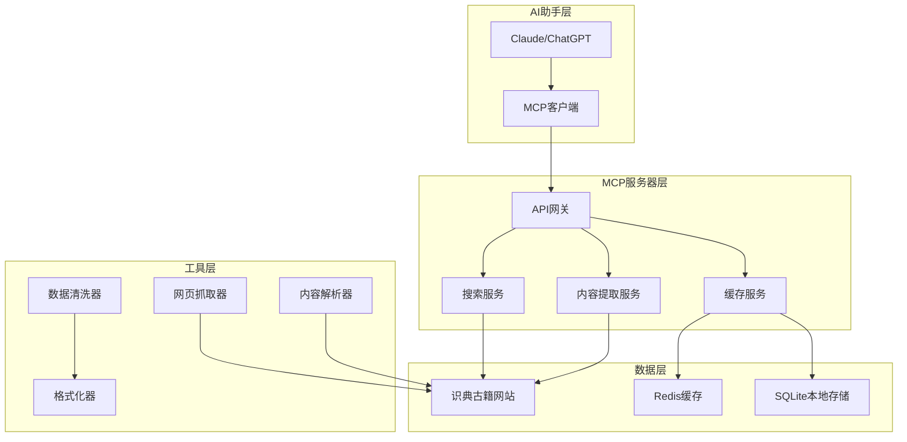
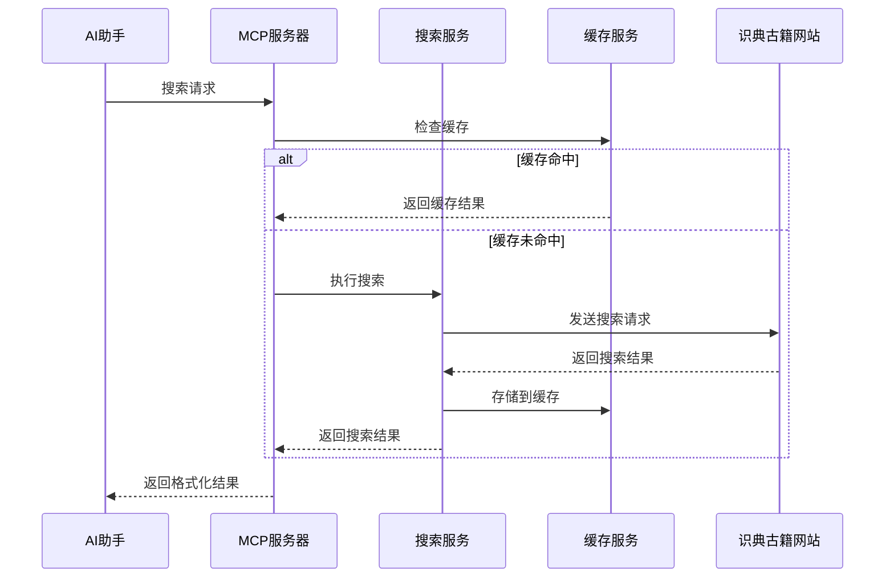
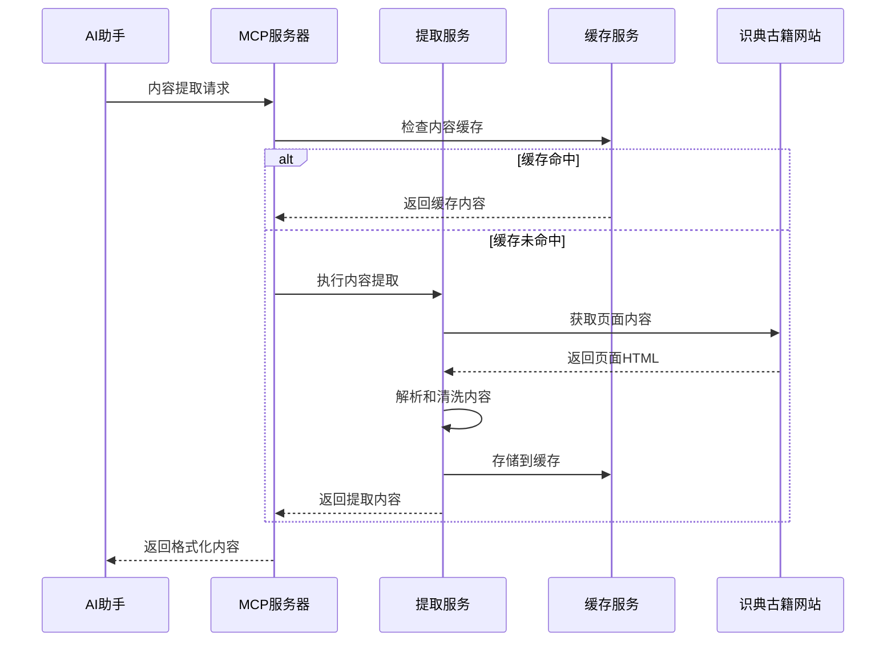

# 古籍MCP服务器架构设计

## 系统架构概览

### 整体架构图



## 核心组件

### 1. MCP服务器核心 (`mcp_server.py`)

**职责**: 
- 实现MCP协议标准
- 管理工具注册和调用
- 处理AI助手的请求路由

**核心功能**:
```python
class GujiMCPServer:
    def __init__(self):
        self.tools = {}
        self.search_service = SearchService()
        self.extract_service = ExtractService()
        self.cache_service = CacheService()
    
    def register_tools(self):
        """注册所有可用工具"""
        pass
    
    def handle_request(self, request):
        """处理MCP请求"""
        pass
```

### 2. 搜索服务 (`search_service.py`)

**职责**:
- 实现识典古籍网站的搜索功能
- 处理搜索参数和过滤条件
- 管理搜索结果缓存

**核心功能**:
```python
class SearchService:
    def search_texts(self, keyword, filters=None):
        """搜索古籍文本"""
        pass
    
    def search_books(self, title, author=None):
        """搜索古籍书籍"""
        pass
    
    def advanced_search(self, query):
        """高级搜索功能"""
        pass
```

### 3. 内容提取服务 (`extract_service.py`)

**职责**:
- 从搜索结果中提取书籍信息
- 获取包含关键词的内容片段
- 处理古籍文本的格式化

**核心功能**:
```python
class ExtractService:
    def extract_book_info(self, book_id):
        """提取书籍详细信息"""
        pass
    
    def extract_content_snippets(self, book_id, keyword):
        """提取内容片段"""
        pass
    
    def get_chapter_content(self, book_id, chapter_id):
        """获取章节内容"""
        pass
```

### 4. 缓存服务 (`cache_service.py`)

**职责**:
- 管理搜索结果缓存
- 实现智能缓存策略
- 提供数据持久化

**核心功能**:
```python
class CacheService:
    def get_cached_result(self, key):
        """获取缓存结果"""
        pass
    
    def set_cached_result(self, key, value, ttl=None):
        """设置缓存结果"""
        pass
    
    def invalidate_cache(self, pattern):
        """清除缓存"""
        pass
```

## 数据流设计

### 搜索请求流程



### 内容提取流程



## 技术选型

### 核心技术栈

| 组件 | 技术选型 | 理由 |
|------|----------|------|
| MCP协议 | Python MCP SDK | 官方支持，功能完整 |
| 网页抓取 | requests + BeautifulSoup4 | 成熟稳定，易于使用 |
| 缓存 | Redis + SQLite | 内存+持久化双重保障 |
| 数据解析 | lxml + regex | 高性能XML/HTML解析 |
| 异步处理 | asyncio + aiohttp | 提高并发性能 |
| 配置管理 | pydantic + python-dotenv | 类型安全，配置验证 |

### 依赖关系

```python
# 核心依赖
mcp>=1.0.0              # MCP协议支持
requests>=2.25.1        # HTTP请求
beautifulsoup4>=4.9.3   # HTML解析
lxml>=4.6.3            # XML解析
redis>=4.0.0           # 缓存服务
pydantic>=2.0.0        # 数据验证

# 开发依赖
pytest>=7.0.0          # 测试框架
black>=22.0.0          # 代码格式化
mypy>=1.0.0            # 类型检查
```

## 性能设计

### 缓存策略

1. **搜索结果缓存**
   - TTL: 1小时
   - 存储位置: Redis
   - 缓存键: `search:{hash(query)}`

2. **书籍信息缓存**
   - TTL: 24小时
   - 存储位置: SQLite
   - 缓存键: `book:{book_id}`

3. **内容片段缓存**
   - TTL: 6小时
   - 存储位置: Redis
   - 缓存键: `content:{book_id}:{keyword}`

### 并发控制

```python
# 请求限流
RATE_LIMIT = {
    "search": "10/minute",      # 搜索请求限制
    "extract": "20/minute",     # 内容提取限制
    "book_info": "30/minute"    # 书籍信息限制
}

# 并发控制
MAX_CONCURRENT_REQUESTS = 5
REQUEST_DELAY = 1.0  # 秒
```

## 安全设计

### 输入验证

```python
from pydantic import BaseModel, validator

class SearchRequest(BaseModel):
    keyword: str
    search_type: str = "full_text"
    limit: int = 10
    
    @validator('keyword')
    def validate_keyword(cls, v):
        if len(v) < 1 or len(v) > 100:
            raise ValueError('关键词长度必须在1-100字符之间')
        return v.strip()
    
    @validator('limit')
    def validate_limit(cls, v):
        if v < 1 or v > 100:
            raise ValueError('结果数量必须在1-100之间')
        return v
```

### 错误处理

```python
class GujiMCPError(Exception):
    """基础异常类"""
    pass

class SearchError(GujiMCPError):
    """搜索相关异常"""
    pass

class ExtractError(GujiMCPError):
    """内容提取异常"""
    pass

class CacheError(GujiMCPError):
    """缓存相关异常"""
    pass
```

## 扩展性设计

### 插件系统

```python
class PluginManager:
    def __init__(self):
        self.plugins = {}
    
    def register_plugin(self, name, plugin):
        """注册插件"""
        self.plugins[name] = plugin
    
    def load_plugin(self, name):
        """加载插件"""
        return self.plugins.get(name)
```

### 数据源扩展

```python
class DataSourceInterface:
    def search(self, query):
        """搜索接口"""
        pass
    
    def extract_content(self, book_id):
        """内容提取接口"""
        pass

class ShidiangujiSource(DataSourceInterface):
    """识典古籍数据源"""
    pass

class OtherSource(DataSourceInterface):
    """其他数据源"""
    pass
```

## 监控和日志

### 日志配置

```python
import logging

LOGGING_CONFIG = {
    'version': 1,
    'disable_existing_loggers': False,
    'formatters': {
        'standard': {
            'format': '%(asctime)s [%(levelname)s] %(name)s: %(message)s'
        },
    },
    'handlers': {
        'default': {
            'level': 'INFO',
            'formatter': 'standard',
            'class': 'logging.StreamHandler',
        },
        'file': {
            'level': 'DEBUG',
            'formatter': 'standard',
            'class': 'logging.FileHandler',
            'filename': 'logs/guji_mcp.log',
        },
    },
    'loggers': {
        'guji_mcp': {
            'handlers': ['default', 'file'],
            'level': 'DEBUG',
            'propagate': False
        }
    }
}
```

### 性能监控

```python
import time
from functools import wraps

def monitor_performance(func):
    @wraps(func)
    def wrapper(*args, **kwargs):
        start_time = time.time()
        result = func(*args, **kwargs)
        end_time = time.time()
        
        logger.info(f"{func.__name__} 执行时间: {end_time - start_time:.2f}秒")
        return result
    return wrapper
```
