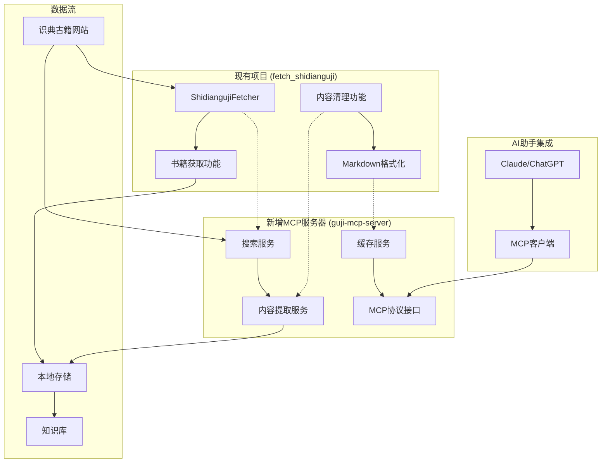

# 集成工作流设计

## 与现有项目的集成方案

### 整体集成架构



## 集成策略

### 1. 代码复用策略

**共享组件**:
- 网页抓取逻辑 (`requests` + `BeautifulSoup4`)
- 内容清理和格式化
- 错误处理和重试机制
- 配置管理 (`python-dotenv`)

**独立组件**:
- MCP协议实现
- 搜索服务逻辑
- 缓存管理
- AI助手接口

### 2. 数据共享方案

```python
# 共享数据结构
class SharedDataModel:
    """共享数据模型"""
    
    @dataclass
    class BookInfo:
        book_id: str
        title: str
        author: str
        dynasty: str
        category: str
        version_info: dict
        quality: str
    
    @dataclass
    class ContentSnippet:
        book_id: str
        chapter_id: str
        content: str
        keyword: str
        context: str
        page_number: int
        relevance_score: float
```

### 3. 配置统一管理

```python
# 统一配置文件 (.env)
# 现有项目配置
BOOK_ID=HY1523
BOOK_TITLE=梦林玄解
OUTPUT_DIR=output
REQUEST_DELAY=1

# MCP服务器配置
MCP_SERVER_HOST=localhost
MCP_SERVER_PORT=8000
CACHE_TYPE=redis
REDIS_URL=redis://localhost:6379/0

# 搜索配置
DEFAULT_SEARCH_LIMIT=10
MAX_SEARCH_LIMIT=100
SEARCH_CACHE_TTL=3600

# 内容提取配置
MAX_CONTENT_LENGTH=1048576  # 1MB
PARALLEL_WORKERS=5
EXTRACTION_TIMEOUT=30
```

## 开发工作流

### 阶段1: 基础架构搭建

**目标**: 建立MCP服务器基础框架

**任务清单**:
- [ ] 创建项目目录结构
- [ ] 实现MCP协议基础框架
- [ ] 集成现有项目的核心功能
- [ ] 建立配置管理系统
- [ ] 实现基础错误处理

**时间估算**: 3-5天

### 阶段2: 搜索功能实现

**目标**: 实现古籍搜索功能

**任务清单**:
- [ ] 分析识典古籍搜索接口
- [ ] 实现搜索服务类
- [ ] 开发搜索参数解析
- [ ] 实现搜索结果格式化
- [ ] 添加搜索缓存机制

**时间估算**: 5-7天

### 阶段3: 内容提取功能

**目标**: 实现内容提取和格式化

**任务清单**:
- [ ] 复用现有内容提取逻辑
- [ ] 实现内容片段提取
- [ ] 开发章节内容获取
- [ ] 实现全文提取功能
- [ ] 添加内容验证机制

**时间估算**: 4-6天

### 阶段4: 缓存和性能优化

**目标**: 优化性能和用户体验

**任务清单**:
- [ ] 实现Redis缓存系统
- [ ] 添加SQLite本地存储
- [ ] 实现智能缓存策略
- [ ] 添加性能监控
- [ ] 优化并发处理

**时间估算**: 3-4天

### 阶段5: 测试和文档

**目标**: 完善测试和文档

**任务清单**:
- [ ] 编写单元测试
- [ ] 实现集成测试
- [ ] 性能测试和优化
- [ ] 完善API文档
- [ ] 编写使用示例

**时间估算**: 4-5天

## 技术实现方案

### 1. 项目结构设计

```
guji-mcp-server/
├── src/
│   ├── guji_mcp_server/
│   │   ├── __init__.py
│   │   ├── server.py              # MCP服务器主文件
│   │   ├── tools/                 # MCP工具定义
│   │   │   ├── __init__.py
│   │   │   ├── search_tools.py    # 搜索工具
│   │   │   ├── extract_tools.py   # 提取工具
│   │   │   └── analysis_tools.py  # 分析工具
│   │   ├── services/              # 服务层
│   │   │   ├── __init__.py
│   │   │   ├── search_service.py  # 搜索服务
│   │   │   ├── extract_service.py # 提取服务
│   │   │   └── cache_service.py   # 缓存服务
│   │   ├── models/                # 数据模型
│   │   │   ├── __init__.py
│   │   │   ├── book.py
│   │   │   ├── content.py
│   │   │   └── search.py
│   │   ├── utils/                 # 工具函数
│   │   │   ├── __init__.py
│   │   │   ├── scraper.py         # 复用现有抓取逻辑
│   │   │   ├── formatter.py       # 复用现有格式化逻辑
│   │   │   └── validator.py
│   │   └── config/                # 配置管理
│   │       ├── __init__.py
│   │       └── settings.py
│   └── shared/                    # 共享组件
│       ├── __init__.py
│       ├── fetcher.py             # 复用ShidiangujiFetcher
│       ├── cleaner.py             # 复用内容清理逻辑
│       └── formatter.py           # 复用格式化逻辑
├── tests/
├── examples/
├── docs/
└── requirements.txt
```

### 2. 核心服务实现

#### 搜索服务实现

```python
# src/guji_mcp_server/services/search_service.py
from typing import List, Dict, Optional
from ..shared.fetcher import ShidiangujiFetcher
from ..models.search import SearchRequest, SearchResult
from ..utils.scraper import SearchScraper

class SearchService:
    def __init__(self, cache_service):
        self.fetcher = ShidiangujiFetcher()
        self.scraper = SearchScraper()
        self.cache = cache_service
    
    async def search_texts(self, request: SearchRequest) -> SearchResult:
        """搜索古籍文本"""
        # 检查缓存
        cache_key = f"search:{hash(str(request))}"
        cached_result = await self.cache.get(cache_key)
        if cached_result:
            return cached_result
        
        # 执行搜索
        search_data = await self.scraper.search(
            keyword=request.keyword,
            search_type=request.search_type,
            category=request.category,
            dynasty=request.dynasty,
            fuzzy=request.fuzzy,
            limit=request.limit
        )
        
        # 格式化结果
        result = self._format_search_result(search_data)
        
        # 缓存结果
        await self.cache.set(cache_key, result, ttl=3600)
        
        return result
```

#### 内容提取服务实现

```python
# src/guji_mcp_server/services/extract_service.py
from typing import List, Dict, Optional
from ..shared.fetcher import ShidiangujiFetcher
from ..models.content import BookInfo, ContentSnippet
from ..utils.formatter import ContentFormatter

class ExtractService:
    def __init__(self, cache_service):
        self.fetcher = ShidiangujiFetcher()
        self.formatter = ContentFormatter()
        self.cache = cache_service
    
    async def extract_book_info(self, book_id: str) -> BookInfo:
        """提取书籍信息"""
        cache_key = f"book_info:{book_id}"
        cached_info = await self.cache.get(cache_key)
        if cached_info:
            return cached_info
        
        # 使用现有fetcher获取书籍信息
        book_data = await self.fetcher.analyze_book_structure()
        book_info = self._parse_book_info(book_data)
        
        # 缓存结果
        await self.cache.set(cache_key, book_info, ttl=86400)
        
        return book_info
    
    async def extract_content_snippets(
        self, 
        book_id: str, 
        keyword: str,
        context_length: int = 200
    ) -> List[ContentSnippet]:
        """提取内容片段"""
        cache_key = f"snippets:{book_id}:{keyword}:{context_length}"
        cached_snippets = await self.cache.get(cache_key)
        if cached_snippets:
            return cached_snippets
        
        # 获取书籍内容
        chapters = await self.fetcher.fetch_book()
        
        # 提取包含关键词的片段
        snippets = []
        for chapter in chapters:
            if keyword in chapter['content']:
                snippet = self._extract_snippet(
                    chapter, keyword, context_length
                )
                snippets.append(snippet)
        
        # 缓存结果
        await self.cache.set(cache_key, snippets, ttl=21600)
        
        return snippets
```

### 3. MCP工具定义

```python
# src/guji_mcp_server/tools/search_tools.py
from mcp import Tool
from ..services.search_service import SearchService
from ..models.search import SearchRequest

def create_search_tools(search_service: SearchService) -> List[Tool]:
    """创建搜索相关工具"""
    
    @Tool
    async def search_ancient_texts(
        keyword: str,
        search_type: str = "full_text",
        category: str = None,
        dynasty: str = None,
        fuzzy: bool = True,
        limit: int = 10
    ) -> dict:
        """搜索包含指定关键词的古籍文本内容"""
        request = SearchRequest(
            keyword=keyword,
            search_type=search_type,
            category=category,
            dynasty=dynasty,
            fuzzy=fuzzy,
            limit=limit
        )
        
        result = await search_service.search_texts(request)
        return result.dict()
    
    @Tool
    async def search_books(
        title: str,
        author: str = None,
        dynasty: str = None,
        category: str = None,
        limit: int = 10
    ) -> dict:
        """搜索古籍书籍信息"""
        # 实现书籍搜索逻辑
        pass
    
    return [search_ancient_texts, search_books]
```

## 部署和运维

### 1. 开发环境部署

```bash
# 克隆项目
git clone <repository-url>
cd guji-mcp-server

# 安装依赖
pip install -r requirements.txt

# 配置环境变量
cp .env.template .env
# 编辑 .env 文件

# 启动Redis (如果使用Redis缓存)
redis-server

# 启动MCP服务器
python -m guji_mcp_server
```

### 2. 生产环境部署

```yaml
# docker-compose.yml
version: '3.8'
services:
  guji-mcp-server:
    build: .
    ports:
      - "8000:8000"
    environment:
      - MCP_SERVER_HOST=0.0.0.0
      - MCP_SERVER_PORT=8000
      - REDIS_URL=redis://redis:6379/0
    depends_on:
      - redis
    volumes:
      - ./logs:/app/logs
      - ./data:/app/data
  
  redis:
    image: redis:7-alpine
    ports:
      - "6379:6379"
    volumes:
      - redis_data:/data

volumes:
  redis_data:
```

### 3. 监控和日志

```python
# 监控配置
MONITORING_CONFIG = {
    'metrics': {
        'search_requests': 'counter',
        'extraction_requests': 'counter',
        'cache_hits': 'counter',
        'cache_misses': 'counter',
        'response_time': 'histogram'
    },
    'alerts': {
        'high_error_rate': 0.05,
        'slow_response_time': 5.0,
        'cache_miss_rate': 0.3
    }
}
```

## 测试策略

### 1. 单元测试

```python
# tests/test_search_service.py
import pytest
from guji_mcp_server.services.search_service import SearchService

@pytest.mark.asyncio
async def test_search_texts():
    """测试文本搜索功能"""
    search_service = SearchService(mock_cache_service)
    
    result = await search_service.search_texts(
        SearchRequest(keyword="道", limit=5)
    )
    
    assert result.success is True
    assert len(result.results) <= 5
    assert all("道" in r.snippet for r in result.results)
```

### 2. 集成测试

```python
# tests/test_integration.py
@pytest.mark.asyncio
async def test_end_to_end_search():
    """端到端搜索测试"""
    # 启动MCP服务器
    server = GujiMCPServer()
    await server.start()
    
    # 执行搜索请求
    result = await server.handle_request({
        "method": "search_ancient_texts",
        "params": {"keyword": "易", "limit": 3}
    })
    
    assert result["success"] is True
    assert len(result["results"]) == 3
```

### 3. 性能测试

```python
# tests/test_performance.py
import asyncio
import time

@pytest.mark.asyncio
async def test_concurrent_requests():
    """并发请求性能测试"""
    search_service = SearchService(cache_service)
    
    # 并发执行100个搜索请求
    tasks = [
        search_service.search_texts(
            SearchRequest(keyword=f"关键词{i}", limit=5)
        )
        for i in range(100)
    ]
    
    start_time = time.time()
    results = await asyncio.gather(*tasks)
    end_time = time.time()
    
    # 验证所有请求都成功
    assert all(r.success for r in results)
    
    # 验证响应时间在合理范围内
    assert (end_time - start_time) < 30.0  # 30秒内完成
```

## 维护和更新

### 1. 版本管理

```python
# version.py
__version__ = "1.0.0"
__version_info__ = (1, 0, 0)

def get_version():
    return __version__

def get_version_info():
    return __version_info__
```

### 2. 更新策略

- **热更新**: 配置和缓存更新无需重启
- **滚动更新**: 服务更新采用滚动部署
- **回滚机制**: 支持快速回滚到上一版本
- **数据迁移**: 自动处理数据结构变更

### 3. 监控指标

- **性能指标**: 响应时间、吞吐量、错误率
- **业务指标**: 搜索成功率、缓存命中率
- **系统指标**: CPU、内存、磁盘使用率
- **用户指标**: 搜索频率、热门关键词
